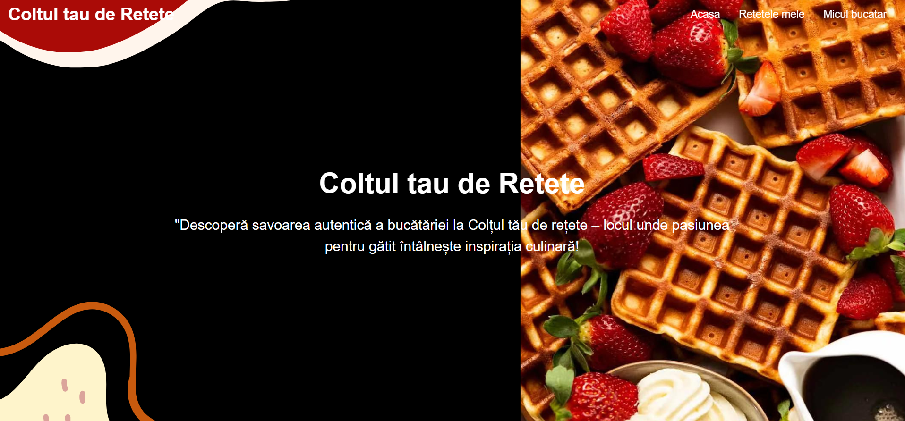
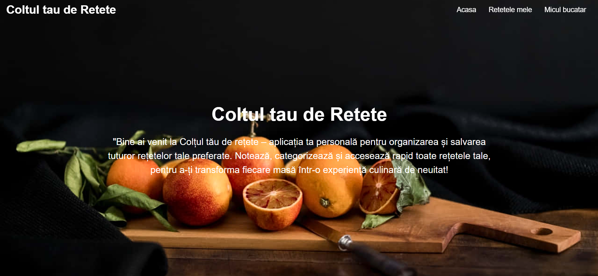
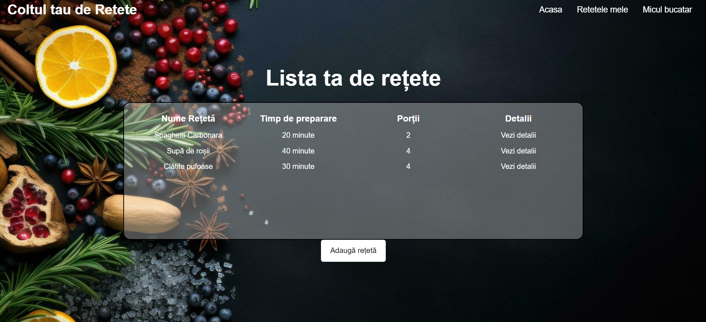
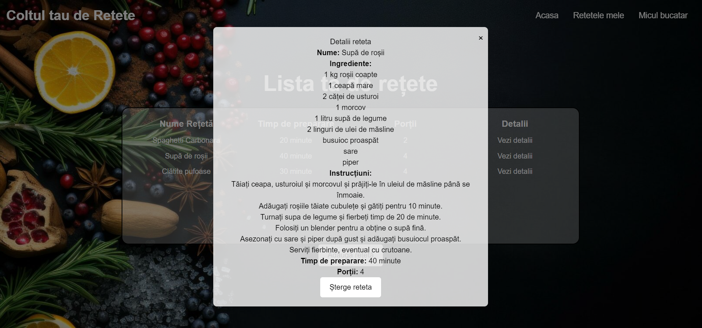
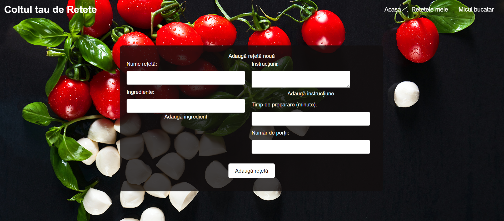
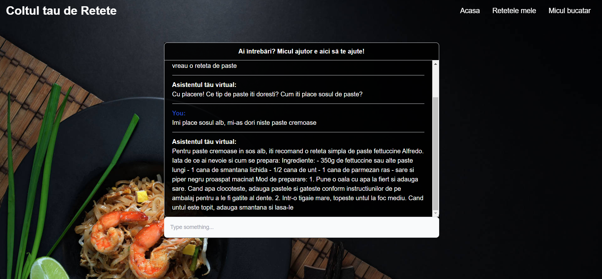

# 1.Descriere problemă:
Aplicația oferă utilizatorilor posibilitatea de a gestiona eficient informațiile despre rețetele lor printr-o singură listă personalizată. Această listă conține toate detaliile relevante despre fiecare rețetă, inclusiv numele rețetei, ingredientele necesare, instrucțiunile de preparare, timpul de preparare și numărul de porții.
Principalele funcționalități ale aplicației includ:

Gestionarea listei de rețete – utilizatorii pot adăuga și șterge rețete din lista lor personalizată, actualizând înregistrările cu informații noi sau modificând detaliile existente.
Gestionarea ingredientelor – utilizatorii pot adăuga și șterge ingrediente pentru fiecare rețetă în parte, asigurându-se că lista de ingrediente este întotdeauna actualizată.
Gestionarea instrucțiunilor – utilizatorii pot adăuga și șterge pași pentru prepararea fiecărei rețete, oferind detalii clare și concise despre modul de preparare.
Vizualizarea detaliată – fiecare înregistrare în listă include informații detaliate despre rețetă, cum ar fi timpul de preparare, numărul de porții și lista completă a ingredientelor necesare.
Prin centralizarea acestor informații într-o singură locație, CookBook facilitează gestionarea și monitorizarea rețetelor și a ingredientelor asociate, oferind o experiență integrată și eficientă pentru pasionații de gătit.

# 2.Descriere API
Serviciul OpenAI - ChatGPT API furnizează o soluție pentru a adăuga capacitățile de conversație ale modelului de limbaj ChatGPT în diverse contexte. Acesta permite dezvoltatorilor să trimită cereri HTTP către serverele OpenAI pentru a primi răspunsuri în timp real de la modelul ChatGPT. 
```
            try {
                setIsLoading(true);
                const response = await fetch('/api/answer', {
                    method: 'POST',
                    headers: {
                        'Content-Type': 'application/json',
                    },
                    body: JSON.stringify({
                        messages: filteredChatHistory,
                        type: 'autoassist',
                    }),
                    signal: AbortSignal.timeout(20000),
                });
                const json = await response.json();

                setUserInput('');
                setIsLoading(false);

                const responseMessageObject = buildResponseMessageObject(json);
                setChatMessages(prevChatMessages => [...prevChatMessages, responseMessageObject]);
            }
            catch (error) {
                console.log(error);
            }
```
În codul de mai sus, se efectuează o cerere către un API (/api/answer) folosind metoda POST. Procesul începe prin activarea stării de încărcare, după care cererea este trimisă către API cu informațiile necesare. În plus, este configurat un semnal de anulare a cererii pentru a limita timpul de răspuns la 20 de secunde, utilizând AbortSignal.timeout(20000).

```
const SYSTEM_PROMPTS = {
    SIMPLE_ASSISTANT: {
        MESSAGE: {
            'role': 'system',
            'content': 'Ești un asistent simplu. Răspunzi cu propoziții simple.',
        },
        TEMPERATURE: 1,
        MAX_TOKENS: 50,
        TYPE: 'simple_assistant',
    },
    MiculAjutor: {
        MESSAGE: {
            'role': 'system',
            'content': 'Te porți ca un bucătar, oferind asistență practică bucătarilor acasă, ghidându-i în găsirea detaliilor esențiale despre rețete și ingrediente potrivite.',
        },
        TEMPERATURE: 1,
        MAX_TOKENS: 200,
        TYPE: 'miculAjutor',
    },
};

```
Configurația de mai sus descrie două tipuri de asistenți virtuali: 
•	SIMPLE_ASSISTANT este un asistent virtual simplu, care furnizează răspunsuri concise și directe. 
•	miculAjutor este descris ca fiind un bucătar care oferă asistență practică bucătarilor acasă.

# 3. Capturi ecran aplicație
## 3.1.	Pagina principala


Pagina principală, reprezentată de componenta MainPage, servește drept introducere și prezentare generală, în timp ce pagina de homepage oferă o prezentare mai detaliată a aplicației.

## 5.2.	Pagina "Acasa"


## 5.3.	Pagina "Retetele mele"


Conceptul principal al acestei pagini este de a oferi utilizatorilor o listă vizuală a rețetelor pe care le au, împreună cu informații esențiale despre fiecare rețetă, cum ar fi numele, ingredientele, instrucțiunile și alte detalii relevante pentru preparare.




Utilizatorii pot vizualiza o listă completă a rețetelor lor și pot accesa detalii suplimentare pentru fiecare rețetă prin intermediul unui modal la clic pe butonul "Vezi detalii". De asemenea, au opțiunea de a șterge rețete din listă folosind butonul "Șterge rețeta", acțiune care actualizează lista în timp real. Pagina include și un buton pentru adăugarea unei noi rețete, care direcționează utilizatorul către o altă pagină sau componentă pentru introducerea rețetelor noi în lista lor.

## 5.4.	Pagina "Adauga Reteta"


Utilizatorii pot introduce ușor informațiile necesare despre fiecare rețetă printr-un formular simplu și pot adăuga detalii despre ingredientele folosite în rețetele respective.

## 5.5.	Pagina "Micul Bucatar"


Pagina "Virtual Assistant" servește ca un ghid interactiv pentru utilizatori în ceea ce privește informațiile despre vehiculele lor și piesele compatibile. Utilizatorii pot adresa întrebări variate, de la specificații despre mașină la recomandări pentru piese de schimb.
